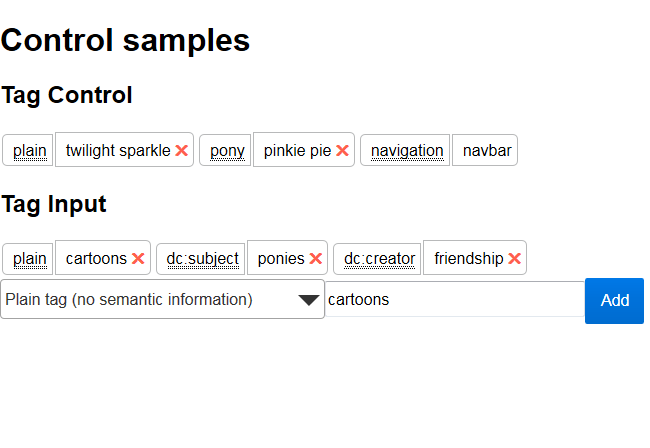

# rm3 Tag Control

This will eventually be a linked data (I'm avoiding using the word RDF : ) ) tagging UI in React.

Right now, it lets you fill a [linked-data-box](https://github.com/rm3web/linked-data-box) object with plain string tags (say, something like Flickr tags) or JSON-LD compatible tags with predicates (say, something more like EXIF tags, where the predicate is "Camera name" and the camera is "Olympus E-M5 Mark II").

I designed it for my own usage in rm3, but there's nothing that will prevent you from using it as a general-purpose tagging editor.

See spa/bundle.js for usage example.

## Targets

* `npm run prepubish` - will use babel to transpile jsx and es6 code to plain es5 javascript to the `dist` folder
* `npm run spa` - starts a web server at `http://localhost:9000` with a single page app that will require your already transpiled react module.
* `npm test`  - will use mocha to run all `rm3-tag-control/test` files

## Thanks

 * https://github.com/VikramN/Re-Tag - I cribbed and/or coppied sections of VikramN's tag editor.
 * https://github.com/goncalvesjoao/react-to-commonJS - Fired up all of the basic deps.